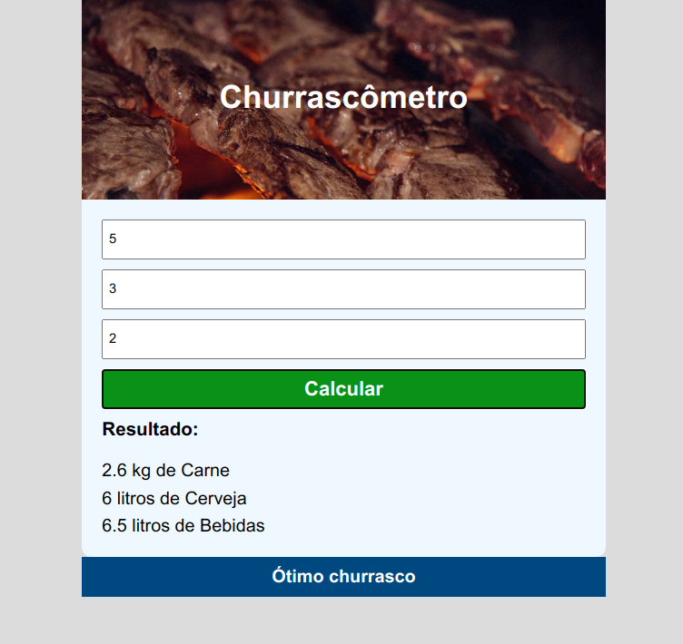

<h1>churrascômetro</h1>

## 🚀 Tecnologias

Esse projeto foi desenvolvido com as seguintes tecnologias:

- [Html5]
- [Css]
- [Javascript]

## 💻 Projeto

Aplicativo que ajudar a calcular o churrasco para os visitantes.

## 🔖 Layout

## Licença

Esse projeto está sob a licença MIT.